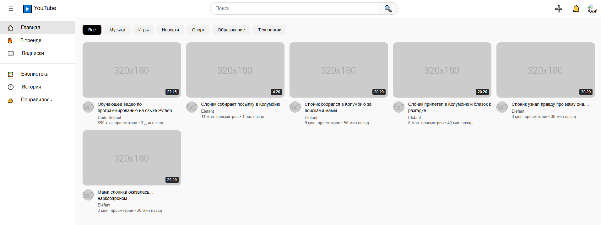
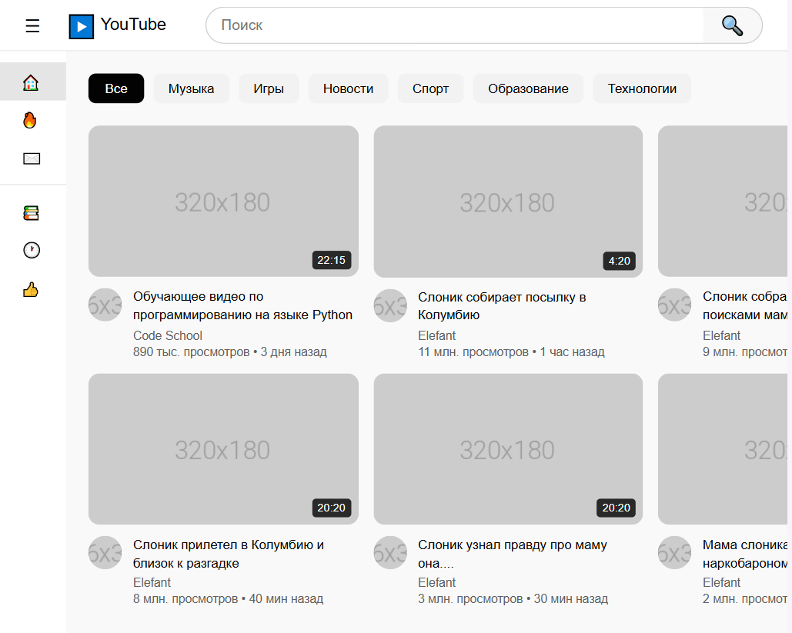
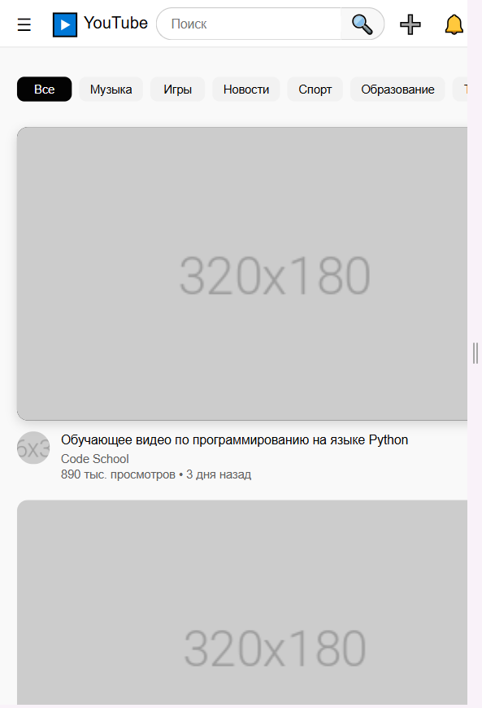

# YouTube Clone - Лабораторная работа №9-10

**Студент:** [Селиванов Павел Беляев Владимир]
**Группа:** [ИСП-233]

---

## Описание

[1. Адаптивный клон главной
страницы YouTube, созданный с использованием HTML, CSS, Flexbox и CSS Grid.
2. Это проект который показывает взаимодействие между css and html
3. Очень интересный и креативный проект.]

---

## Реализованные функции

- [ ] Адаптивный хедер с поиском
- [ ] Боковая панель навигации
- [ ] Категории (чипсы) с интерактивностью
- [ ] Сетка видео с карточками
- [ ] Hover-эффекты на карточках
- [ ] Полная адаптивность под все устройства
- [ ] [Добавьте свои функции]

---

## Технологии

- HTML5
- CSS3
- Flexbox
- CSS Grid
- Media Queries

---

## Скриншоты

### Desktop (1920px)

### Tablet (1024px)

### Mobile (575px)

## 

## Как запустить

1. Откройте файл `index.html` в браузере
2. Или используйте **Live Server** в VS Code:

- Установите расширение Live Server
- Правой кнопкой по `index.html` → Open with Live Server

---

## Структура проекта

---

## Вывод

["В ходе выполнения лабораторной работы я изучил основы адаптивной вёрстки, освоил работу с Flexbox и CSS Grid, научился создавать интерактивные элементы с помощью CSS.
Проект помог мне лучше понять принципы создания современных веб-интерфейсов."
Ну в целом тут нечего больше написать всё по факту]

---

## Дата выполнения

17.02.2026
